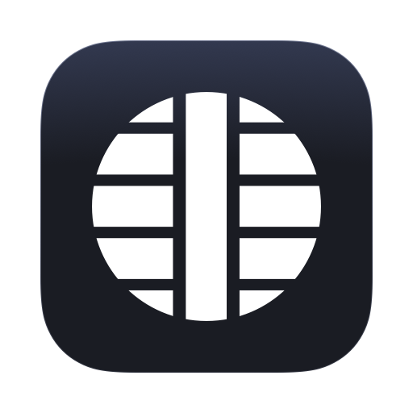

<a href="https://github.com/mjovanc/falcon">
  
</a>

# Yggdrasil Wallet

Yggdrasil is the most current Kryptokrona GUI Wallet built with Svelte and Electron.

# Table of Contents

- [Table of Contents](#table-of-contents)
- [Development Resources](#development-resources)
- [Technologies](#technologies)
- [Getting Started](#getting-started)
  - [Build](#build)
- [Contribute](#contribute)
  - [Pull Request](#pull-request)
- [Contributors](#contributors)
- [License](#license)

# Development Resources

-   Web: https://kryptokrona.org
-   GitHub: https://github.com/kryptokrona
-   Hugin: XKR group on `2977d5ca9b173c0f9f137f1be6823dd2cdd8f953bd84e6d3e5e4571539644531`
-   It is HIGHLY recommended to join our group on Hugin Messenger if you want to contribute to stay up to date on what is happening on the project.

# Technologies

- Node 16 (16.16.0 currently)
- Electron
- Svelte
- Hypercore Protocol

# Getting Started

> \*Feel free to substitute `npm` with `pnpm` or `yarn`.

|         |                   |
| ------- | ----------------- |
| Install | · `npm install`   |
| Develop | · `npm run dev`   |


## Build
To build a target we have the following options:


|                          |                             |
|--------------------------|-----------------------------|
| macOS Apple Silicon (M1) | · `npm run build:mac-arm64` |
| macOS Intel (x64)        | · `npm run build:mac-x64`   |
| Windows                  | · `npm run build`           |
| Linux                    | · `npm run build:linux-x64` |

# Contribute

## Pull Request

We appreciate all contributions whether it be small changes such as documentation of source code to major improvement of code. The easiest way is to make a fork and then make a pull request into our main branch. To make the PR go through make sure to include this information:

```
What does this PR do?

Why are these changes required?

This PR has been tested using (e.g. Unit Tests, Manual Testing):

Extra details?
```

A pull request is approved if the GitHub Actions pipeline is marked green. Otherwise it will be closed directly. Always make sure to run the unit tests before creating a pull request.

# Contributors

The following contributors have either helped to start this project, have contributed
code, are actively maintaining it (including documentation), or in other ways
being awesome contributors to this project. **We'd like to take a moment to recognize them.**

[](https://github.com/Swepool)
[](https://github.com/n9lsjr)
[](https://github.com/f-r00t)
[](https://github.com/mjovanc)
[](https://github.com/zahraalemi)

# License

The license is MIT License.
